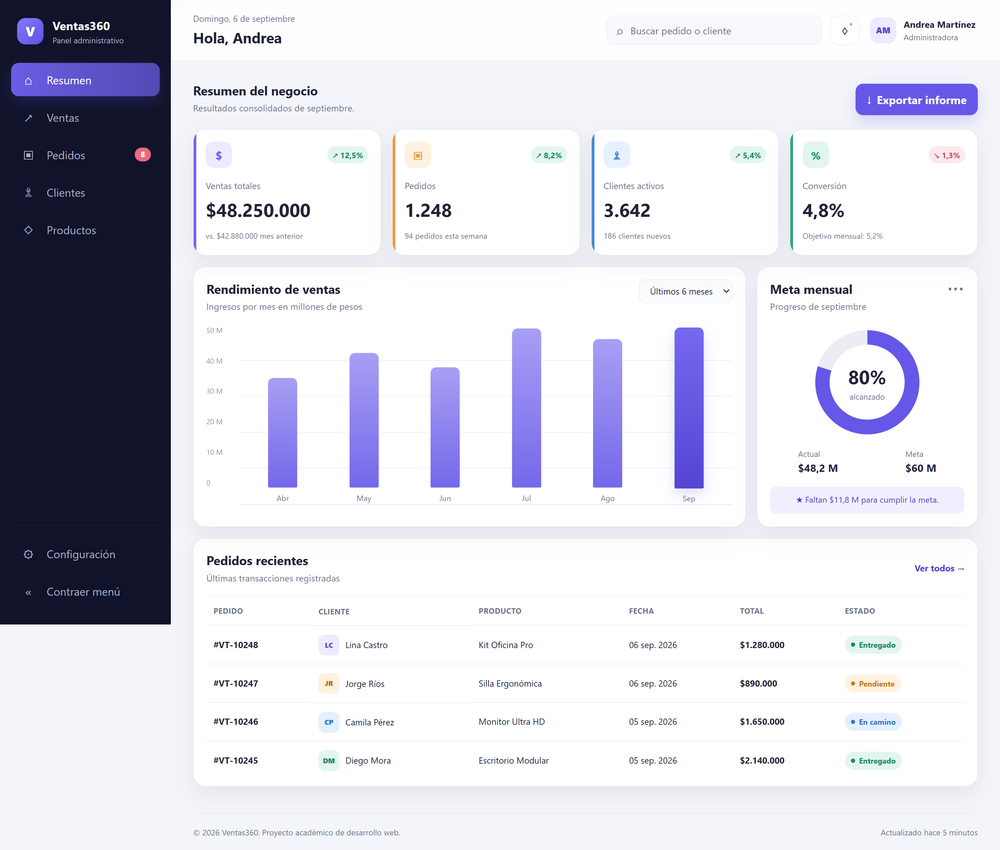
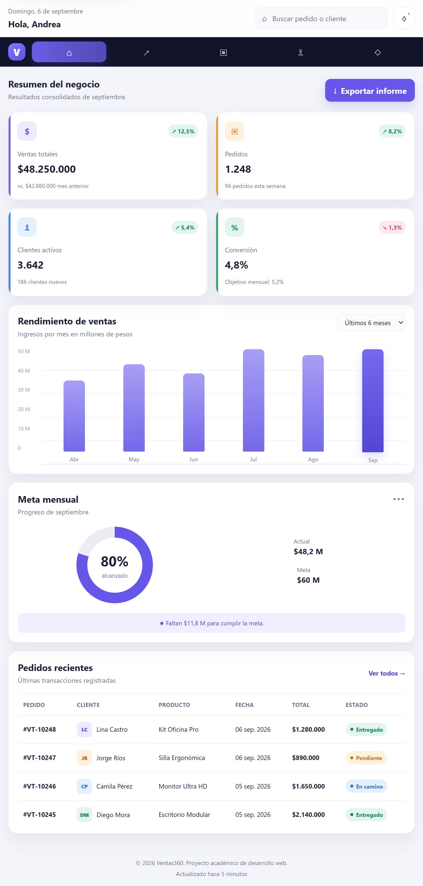
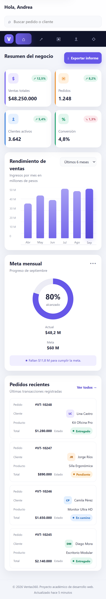

# Ventas360 — Dashboard administrativo

Ventas360 es un dashboard administrativo responsive para visualizar indicadores de ventas, pedidos, clientes y cumplimiento de metas. El proyecto usa datos ficticios con fines académicos.

## Tecnologías utilizadas

- HTML5 semántico
- CSS3: Grid, Flexbox, variables, media queries, transiciones y pseudo-clases
- JavaScript nativo para interacciones sencillas

## Componentes principales

1. Barra lateral de navegación colapsable.
2. Encabezado con búsqueda, notificaciones y perfil.
3. Tarjetas de indicadores con cambios porcentuales.
4. Gráfico de barras y medidor circular de meta.
5. Tabla responsive de pedidos recientes.
6. Footer informativo.

## Interactividad

- El botón **Contraer menú** reduce el ancho de la barra lateral en escritorio.
- El campo de búsqueda filtra los pedidos por código, cliente, producto, fecha, total o estado.
- El botón **Exportar informe** muestra una confirmación accesible.
- Las tarjetas, enlaces y barras del gráfico responden al cursor y al foco del teclado.

## Diseño responsive

- **Escritorio:** sidebar completo y cuatro indicadores en una fila.
- **Tablet:** sidebar compacto, indicadores en dos columnas y contenido ajustado.
- **Móvil:** navegación horizontal superior y tabla convertida en tarjetas.

## Evidencias del diseño responsive

### Vista de escritorio



### Vista de tablet



### Vista móvil



## Accesibilidad

- Etiquetas semánticas (`header`, `nav`, `main`, `section`, `footer`).
- Roles ARIA y nombres accesibles en controles e indicadores visuales.
- Enlace para saltar directamente al contenido principal.
- Estados de foco visibles y navegación por teclado.
- Contraste suficiente entre texto y fondo.
- Compatibilidad con la preferencia de movimiento reducido.
- Encabezados de tabla y textos alternativos mediante `aria-label` para los gráficos.

## Cómo ejecutar el proyecto

1. Descarga o clona el repositorio.
2. Abre `index.html` en un navegador moderno.
3. No requiere instalación de dependencias.

## Decisiones de diseño

Se eligió una interfaz sobria con fondo claro y sidebar oscuro para separar la navegación del área de análisis. CSS Grid organiza la estructura general y las zonas de contenido, mientras Flexbox alinea los elementos internos. El color violeta identifica las acciones principales; los demás colores se reservan para categorías y estados.

## Estructura

```text
ventas360-dashboard/
├── index.html
├── styles.css
├── README.md
└── evidencias/
    ├── escritorio.png
    ├── tablet.png
    └── movil.png
```

## Publicación en GitHub

1. Crea un repositorio público llamado `ventas360-dashboard`.
2. Sube todos los archivos conservando la carpeta `evidencias`.
3. En GitHub, abre **Settings → Pages**.
4. En **Build and deployment**, selecciona **Deploy from a branch**.
5. Elige la rama `main`, la carpeta `/root` y guarda.

Después de unos minutos, GitHub mostrará la URL pública del dashboard.
